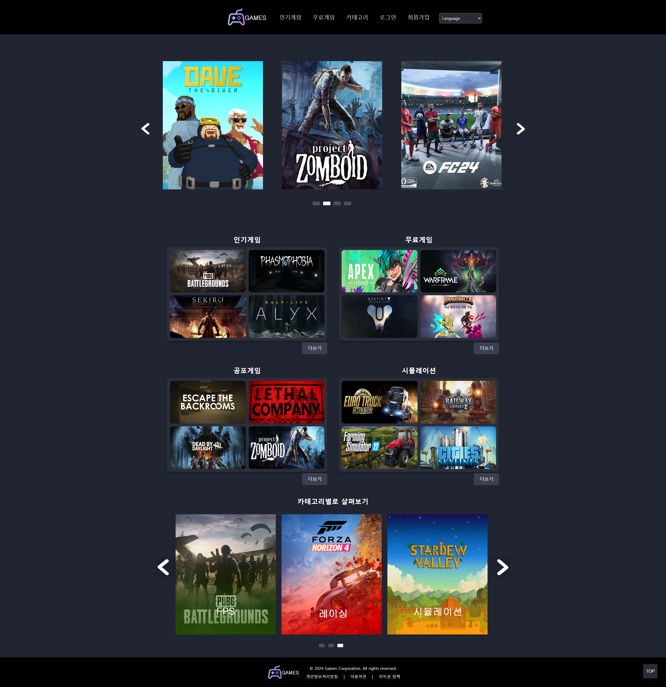

# 🎮 GameReviewService

게임에 대한 정보를 확인하고, 별점과 리뷰를 작성 및 관리할 수 있는 웹 서비스입니다.

---

## 🛠️ 주요 기능

- ✅ 회원가입 / 로그인
- ✅ 게임 목록 조회 및 상세 정보 확인
- ✅ 별점 및 리뷰 작성, 수정, 삭제
- ✅ 관심 게임 찜하기
- ✅ 마이페이지 (회원 정보 수정, 회원탈퇴, 찜한 게임 목록, 내가 작성한 리뷰 목록)

---

## 📷 스크린샷



시연 동영상 https://youtu.be/kiBWWQpHalM?si=kcBIfFdNPCE0oi2i

## 🧰 기술 스택

### 🔹 Frontend
- React
- React Router DOM
- CSS
- LocalStorage
- SessionStorage

### 🔹 기타
- Git & GitHub
- VSCode 개발

---

## 👤 개발자

- 이름: 신동희
- GitHub: [@devdoni](https://github.com/devdoni)  
- 이메일: devdoni1005@gmail.com
---

## 📌 실행 방법

```bash
git clone https://github.com/devdoni/GameReviewService.git
cd GameReviewService
npm install
npm start
